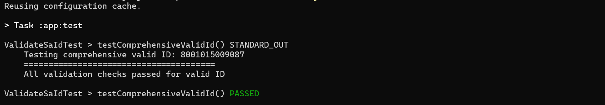

# 🛠️ **Gradle by Hand: With Command Line Prompt**  
### If you use tools that do all your thinking for you, you’ll struggle when things break. To **become a pro**, it’s worth doing things manually—at least for a while. 

### 🚫 No IDE Allowed (We are doing it for Fun)
### 💻 Come On, You Only Need CMD
### 🤖 Who Are We Without AI? LOL
### 🛠️ Embrace Generative AI as Your Assistant
### 🔍 However, Understand What It Provides
### 💥 Don't Forget to Challenge It Hard

## 🚀 Getting Started

### 📋 Prerequisites
- Java Development Kit (JDK) 8 or later
- Git (optional, for cloning)
- Terminal/Command Prompt
- Gradle 7.0+ (wrapper included)

### 🛠️ Setup Instructions
1. **Clone the repository:**
   ```bash
   git clone https://github.com/Kutullo20/validate_sa_id.git
2. **Navigate to project directory:**
   ```bash
   cd validate_sa_id
3. **Build the project using Gradle wrapper:**
   ```bash
   ./gradlew build  # Linux/Mac
   gradlew.bat build  # Windows
4. **Run tests:**
   ```bash
   ./gradlew test

## 📦 Features
- ✅ Full validation of South African ID numbers
- 📅 Date validation (including leap years)
- ♀️♂️ Gender detection from ID digits
- 🛂 Citizenship status identification
- 🔢 Luhn checksum verification

### 📊 Previous Test Results
1. **Navigate to previous branches:**
   ```bash
   git branch -a  # List all branches
   git checkout <branch-name>  # Switch to target branch
2. **Run tests individually:**
   ```bash
   ./gradlew test --tests "validate_sa_id.ValidateSaIdTest"

## 👀 Results Preview 



   
